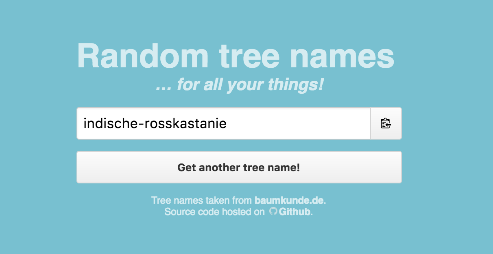

# random-tree-names

> Get random tree names for all your things!

[](https://pguth.github.io/random-tree-names/)

##### Tree name sources

- **[de](tree-names-de.json)**: [baumkunde.de](http://www.baumkunde.de/baumlisten/baumliste_az.php)

## Install

```
$ npm install random-tree-names
```


## Usage

### Module

```js
const treeNames = require('random-tree-names')

treeNames.random()
// => 'chenault-schneebeere'
```

### Browser

```js
npm start
// => http://localhost:9966
```

## API

### .all

Type: `array`

Top 100 cat names in alphabetical order.

### .random()

Type: `function`

Random cat name.


## CLI

```
$ npm install -g random-tree-names
```

```
$ random-tree-names --help

  Examples
    $ random-tree-names
    Max

    $ random-tree-names --all
    Abby
    Angel
    ...

  Options
    --all   Get all names instead of a random name
```


## Related

- [cat-names](https://github.com/sindresorhus/cat-names) - Get popular cat names
- [dog-names](https://github.com/sindresorhus/dog-names) - Get popular dog names
- [pokemon](https://github.com/sindresorhus/pokemon) - Get Pokémon names
- [superb](https://github.com/sindresorhus/superb) - Get superb like words
- [superheroes](https://github.com/sindresorhus/superheroes) - Get superhero names
- [supervillains](https://github.com/sindresorhus/supervillains) - Get supervillain names
- [yes-no-words](https://github.com/sindresorhus/yes-no-words) - Get yes/no like words


## License

MIT
